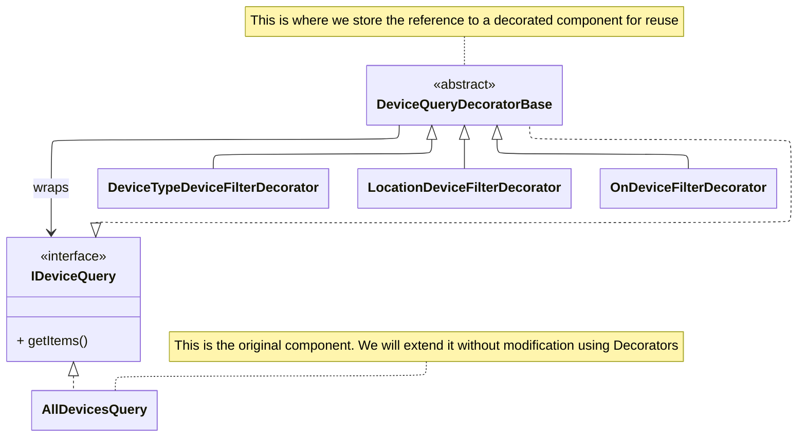

[Return to Project Overview](../../../../../../../../../README.md)

# Decorator Pattern

***

The Decorator Pattern is used to dynamically extend device query behavior by wrapping a base query object with additional filtering layers. 
Each decorator adds a new filtering rule while preserving the original query interface.

This allows multiple filters to be composed at runtime without modifying existing query logic or creating an excessive number of specialized query classes.

My implementation of the Decorator Pattern can be found in the `/devicequeries` directory

---

## Purpose

The pattern is used to build flexible and composable device queries by layering filtering behavior. 
Each decorator wraps another query and refines its results.

This enables the system to support dynamic filtering combinations such as:
- Device type filtering
- Location filtering
- Power status filtering

---

## How It Works

1. A base query retrieves an initial set of devices
2. Each decorator wraps the previous query
3. Each layer applies an additional filter to the result set
4. The final wrapped query returns the fully filtered result

Each decorator implements the same query interface, allowing them to be stacked interchangeably.

---

## Example Flow

Base Query → Type Filter Decorator → Location Filter Decorator → Status Filter Decorator → Final Result

Each layer wraps the previous one and refines its output.

---

# UML Diagram

- **AllDevicesQuery** -- the core behavior (the original class requiring decoration)
- **IDeviceQuery** -- the interface providing a stable contract for the AllDevicesQuery and the decorators
- **DeviceQueryDecoratorBase** -- wraps a component and delegates
- **ConcreteDecorators** -- add one responsibility per concrete class

## Core Idea

Instead of creating rigid query methods such as:

- getOnFansInLivingRoom()
- getOffLightsInKitchen()
- getActiveThermostats()

The system composes queries dynamically using wrapped decorators that each apply a single filtering responsibility.

---

## Benefits

- Flexible runtime query composition
- Avoids combinatorial explosion of query methods/classes
- Promotes single-responsibility filtering layers
- Easily extendable with new filter types
- Preserves open/closed principle by adding decorators instead of modifying existing code
