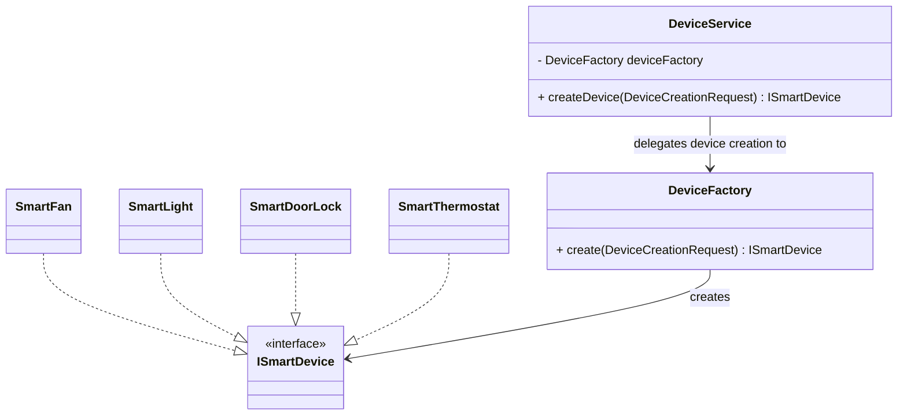

[Return to Project Overview](../../../../../../../../../../README.md)

# Device Factory

***

The Factory Pattern is used to centralize the creation of smart devices into a single responsibility layer. 
Instead of instantiating devices directly throughout the codebase, all device creation is handled through a dedicated factory.

The implementation of the factory pattern can be found in the `devicefactories` directory.

This improves maintainability by reducing coupling between system components and concrete device implementations.

---

## Purpose

The factory ensures that all smart devices are created consistently and in a controlled manner. 
This avoids scattered object creation logic and makes it easier to introduce new device types without modifying existing code.

---

## Supported Devices

The factory is responsible for creating the following device types:

- Smart Light
- Smart Fan
- Smart Door Lock
- Smart Thermostat

---

## How It Works

The factory receives a `DeviceCreationRequest` which contains a device type identifier and returns an instance of the corresponding smart device implementation.

Example flow:
- Input: `DeviceCreationRequest` containing a device type (e.g., `"Fan"`)
- Output: concrete `SmartDevice` implementation

The calling code does not need to know the specific class being instantiated.

## UML Diagram

\* Note: My implementation introduces the `ISmartDeviceFactory` class to 
allow the `DeviceService` to rely on an abstraction instead of a concrete factory,
allowing me to freely swap out different possible factories.
I only implement 1 concrete factory, so I feel that it is unnecessary to add it to the UML diagram. 
(I recognize that this would mean that the strategy pattern could also be applied) 

---

## Benefits

- Centralized object creation logic
- Reduced dependency on concrete classes
- Easier to extend with new device types
- Improves code readability and maintainability