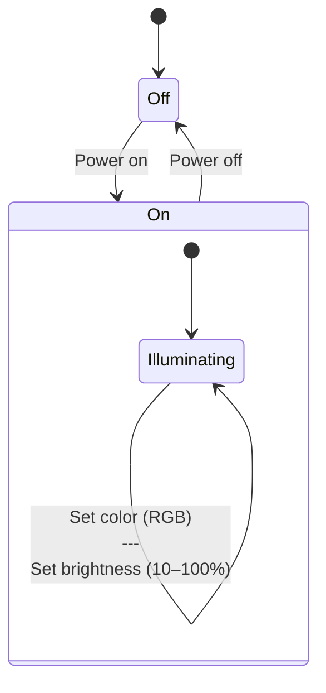
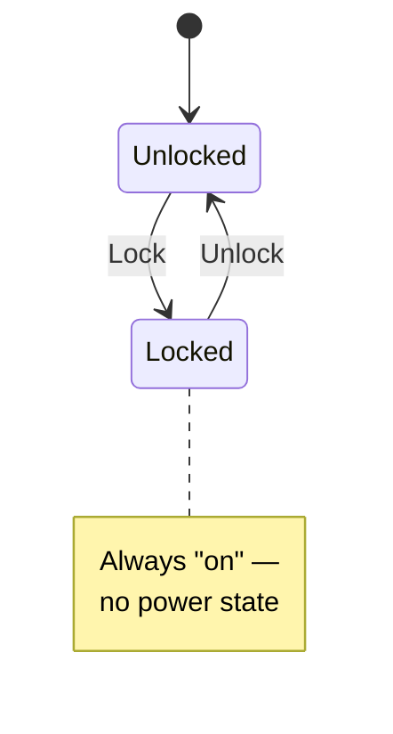
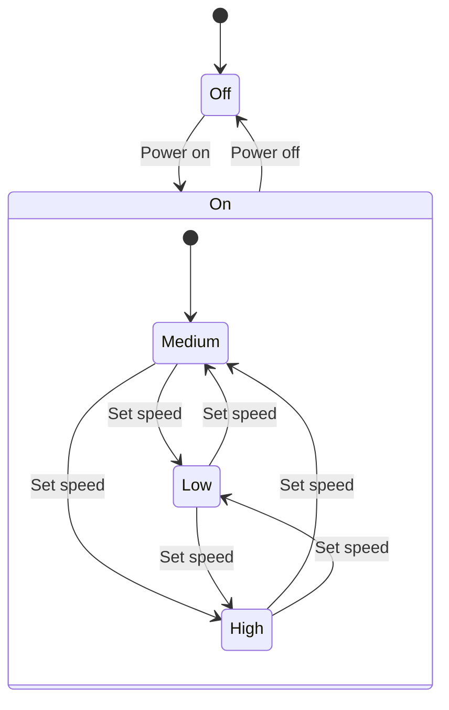
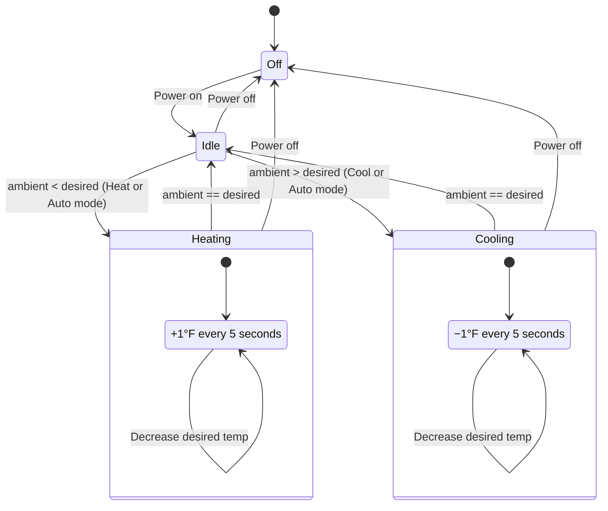

[Return to Project Overview](../../../../../../../../../../README.md)

# State Pattern

***

## Implementation

The State Pattern is implemented using a class-based design and is located in the `/statemachine` directory

Each smart device maintains a reference to a `state` object, which defines behavior for that device in its current state. A shared `DeviceState` interface (or abstract class) defines common actions, and each concrete state class implements state-specific behavior.

### Structure
- **SmartDevice (Context)**
  - Maintains current state
  - Delegates actions to state objects

- **IState & StateBase (Interface / Abstract Class)**
  - Defines common device actions

- **Concrete State Classes**
  - Implement behavior for specific states (e.g., `FanOnState`, `FanOffState`, `HeatingState`, `CoolingState`)

### State Transitions
When an action is invoked, the current state determines whether a transition is valid. If so, the state updates the device’s current state accordingly.

This approach removes the need for large conditional statements and keeps behavior encapsulated within state classes.

---

## Statechart Diagrams

Note: These Diagrams are copied from the assignment instructions

Light:

Lock:

Fan:

Thermostat:

## States

Each device type defines its own set of states:

- Door Lock: Locked, Unlocked
- Fan: On, Off
- Light: On, Off
- Thermostat: Off, Idle, Heating, Cooling

---

## Transitions

Each device defines its own set of transitions. When calling the API, use one of the values below as the action to perform:

### Door Lock
- Locked -- (UNLOCK) --> Unlocked
- Unlocked -- (LOCK) --> Locked

### Fan
- On -- (TURN_FAN_OFF) --> Off
- Off -- (TURN_FAN_ON) --> On
- On -- (UPDATE_SPEED) --> On

\* “UPDATE_SPEED” is handled internally by each state and does not trigger a state transition.

### Light
- On -- (TURN_LIGHT_OFF) --> Off
- Off -- (TURN_LIGHT_ON) --> On
- On -- (UPDATE_COLOR) --> On
- On -- (UPDATE_BRIGHTNESS) --> On

\* “UPDATE_BRIGHTNESS” and "UPDATE_COLOR" are handled internally by each state and do not trigger a state transition.

### Thermostat
  - Off -- (POWER_THERMOSTAT_ON) --> Idle
  - Idle -- (START_HEATING) --> Heating
  - Idle -- (START_COOLING) --> Cooling
  - Idle -- (POWER_THERMOSTAT_OFF) --> Off
  - Cooling -- (STOP_COOLING) --> Idle
  - Cooling -- (POWER_THERMOSTAT_OFF) --> Off
  - Heating -- (STOP_HEATING) --> Idle
  - Heating -- (POWER_THERMOSTAT_OFF) --> Off
  - Any State -- (UPDATE_DESIRED_TEMP) --> Same State
  - Any State -- (UPDATE_MODE) --> Same State

\* “UPDATE_DESIRED_TEMP” and "UPDATE_MODE" are handled internally by each state and do not trigger a state transition.

---

## Design Benefits

- Encapsulation of state-specific behavior
- Reduced conditional logic in device classes
- Improved scalability for adding new devices and states
- Clear separation of concerns between devices and behavior logic
