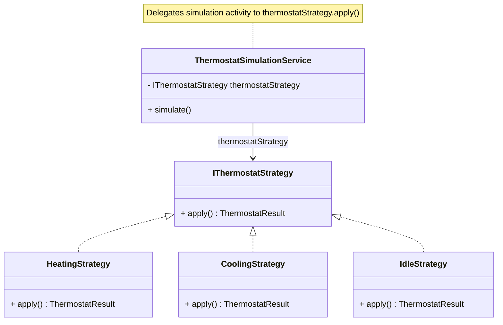
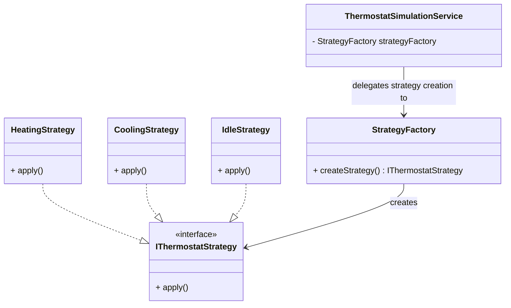

[Return to Project Overview](../../../../../../../../../README.md)

# Thermostat Strategy 

***

The thermostat simulation feature models dynamic temperature control behavior using a combination of the Strategy and Factory design patterns. This allows the system to simulate different heating and cooling behaviors that can be selected and changed at runtime.

---

## Overview

The thermostat adjusts the environment temperature based on:
- Desired temperature set by the user
- Current ambient temperature
- Active operating mode (Heating, Cooling, or Idle)

Different control behaviors are required depending on the selected mode, which is why the Strategy Pattern is used.

---

## Strategy Pattern Usage

The Strategy Pattern is used to define interchangeable temperature control behaviors.

Each strategy encapsulates a specific algorithm, such as:
- Heating behavior (increasing temperature over time)
- Cooling behavior (decreasing temperature over time)
- Idle behavior (no temperature change)

This allows the thermostat to switch behavior dynamically at runtime without modifying core logic.

## UML Diagram

---

## Factory Pattern Usage

The Factory Pattern is used to encapsulate the creation of thermostat strategy objects.

Instead of instantiating strategies directly, the system requests a strategy from the factory based on the current thermostat mode and temperature.

This centralizes creation logic and ensures consistency when selecting strategy implementations.

## UML Diagram

---

## How They Work Together

1. The thermostat determines the current mode (Heating, Cooling, Idle)
2. The Factory selects and returns the appropriate Strategy instance
3. The Strategy defines how temperature changes are applied
4. The thermostat executes the strategy each simulation cycle

---

## Benefits

- Supports dynamic runtime behavior changes
- Encapsulates temperature control algorithms
- Removes conditional logic from thermostat core class
- Makes it easy to add new control strategies in the future